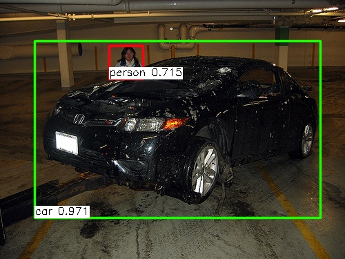
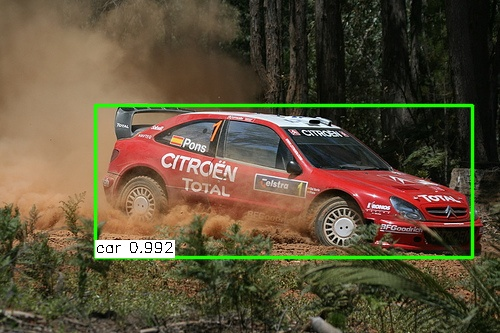
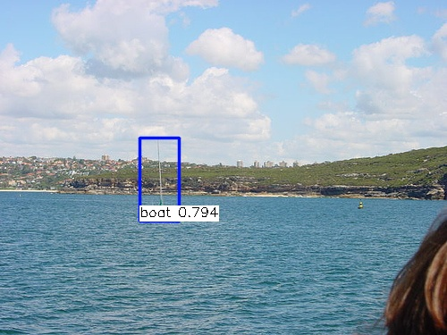

# FSAF
This is an implementation of [FSAF](https://arxiv.org/abs/1903.00621) on keras and Tensorflow. The project is based on [fizyr/keras-retinanet](https://github.com/fizyr/keras-retinanet)
and fsaf branch of [zccstig/mmdetection](https://github.com/zccstig/mmdetection/tree/fsaf). 
Thanks for their hard work. 

As the authors write, **FASF module can be plugged into any single-shot detectors with FPN-like structure smoothly**. 
I have also tried on [yolo3](yolo). Anchor-free yolo3(with FSAF) gets a comparable performance with the anchor-based counterpart. But you don't need to pre-compute the anchor sizes any more.
And it is much better and faster than the one based on retinanet.

## Test
1. I trained on Pascal VOC2012 trainval.txt + Pascal VOC2007 train.txt, and validated on Pascal VOC2007 val.txt. There are 14041 images for training and 2510 images for validation.
2. The best evaluation results (score_threshold=0.05) on VOC2007 test are: 

| backbone | mAP50 |
| ---- | ---- |
| resnet50 | 0.7248 | 
| resnet101 | 0.7652 |

3. Pretrained models are here.   
[baidu netdisk](https://pan.baidu.com/s/1ZdHvR-03XqHvxWG0rLCw1g) extract code: rbrr     
[goole dirver](https://drive.google.com/open?id=1Hcgxp5OwqNsAx-HYgcIhLat1OOHKnvJ2)

4. `python3 inference.py` to test your image by specifying image path and model path there. 

 

## Train
### build dataset (Pascal VOC, other types please refer to [fizyr/keras-retinanet](https://github.com/fizyr/keras-retinanet))
* Download VOC2007 and VOC2012, copy all image files from VOC2007 to VOC2012.
* Append VOC2007 train.txt to VOC2012 trainval.txt.
* Overwrite VOC2012 val.txt by VOC2007 val.txt.
### train
* `python3 train.py --backbone resnet50 --gpu 0 --random-transform pascal datasets/VOC2012` to start training.
## Evaluate
* `python3 utils/eval.py` to evaluate by specifying model path there.
